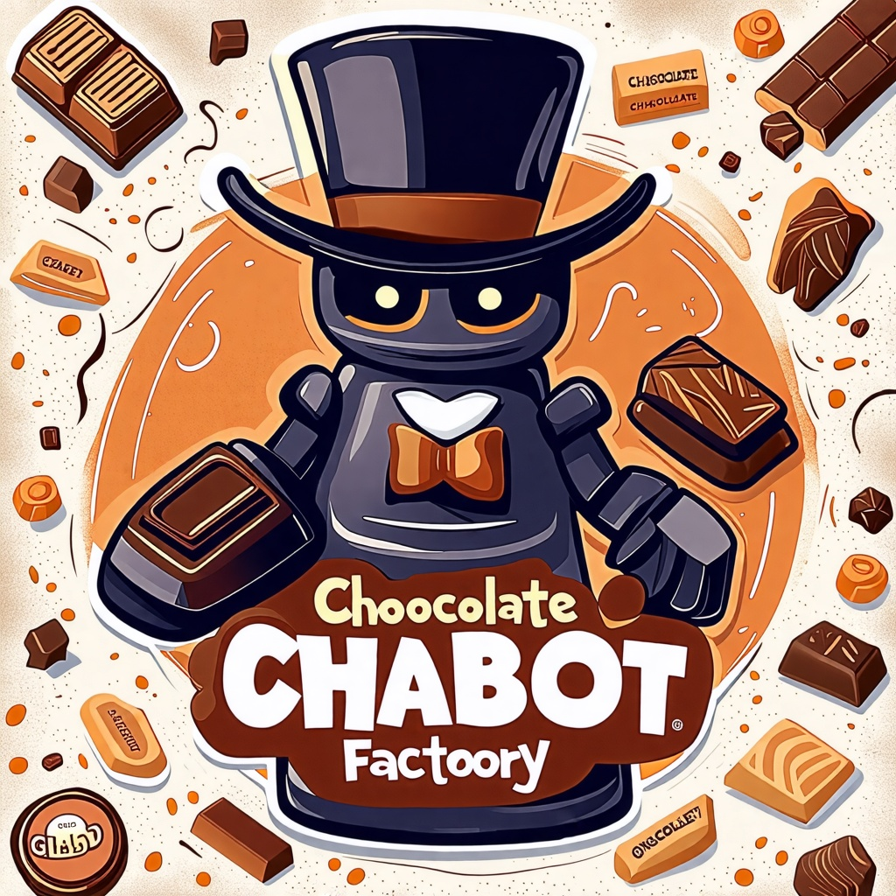
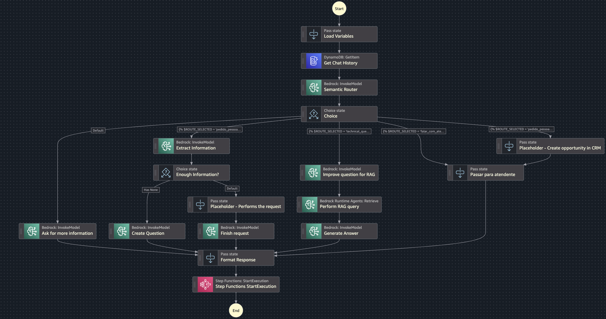

# Semantic-Router-Chocolate-Factory



## Introdução
Este projeto demonstra o poder de um roteador semântico utilizando AWS Step Functions e Amazon Bedrock para criar uma solução inovadora e inteligente. Inspirado no universo mágico de Willy Wonka ✨, o caso de uso consiste em um chatbot para atendimento de uma fábrica de chocolates, capaz de oferecer respostas precisas 🍬 e personalizadas aos clientes.

A ideia central é ilustrar como um roteador semântico pode direcionar mensagens 📬 e solicitações de forma eficiente para diferentes fluxos, garantindo que cada cliente receba a melhor experiência possível 🌟. Por meio do uso de ferramentas avançadas da AWS 🛠️, o projeto destaca:

* Integração inteligente 🤝: conexão fluida entre fluxos de atendimento e modelos de linguagem.
* Escalabilidade 📈: suporte a diversos cenários de interação com alta performance.
* Personalização 🎯: respostas adaptadas ao contexto das solicitações.

Seja você um entusiasta de IA 💡, desenvolvedor 👨‍💻👩‍💻 ou arquiteto de soluções 🏗️, este repositório oferece uma base sólida para explorar o potencial de aplicações modernas em AI/ML e serverless.

## O que é um Roteador Semântico? 🤔🔍

Um roteador semântico é uma solução baseada em inteligência artificial que compreende o significado (ou semântica) de uma mensagem ou solicitação e a direciona ao fluxo mais adequado. Em vez de depender de palavras-chave ou regras rígidas, ele analisa o contexto e a intenção por trás de cada interação, tornando o processamento mais inteligente e eficiente.

Por que um Roteador Semântico é importante? 🚀
Em sistemas baseados em IA generativa, como chatbots, um roteador semântico desempenha um papel fundamental para melhorar a experiência do usuário e otimizar recursos, oferecendo benefícios como:

* Redução de alucinações 🎭: diminui a probabilidade de respostas incoerentes ou imprecisas, direcionando solicitações apenas para modelos ou fluxos capazes de lidar com o contexto corretamente.
* Menor latência ⚡: ao encaminhar as solicitações diretamente para os serviços ou fluxos mais adequados, elimina atrasos desnecessários, resultando em interações mais rápidas.
* Custo otimizado 💰: evita o uso excessivo de modelos avançados ou fluxos complexos para solicitações simples, otimizando o consumo de recursos e reduzindo despesas operacionais.
* Precisão no atendimento 🎯: garante que as solicitações sejam tratadas de forma eficaz, conectando os usuários às respostas ou soluções mais relevantes.
No contexto deste projeto, o roteador semântico ajuda o chatbot da fábrica de chocolates 🍫 a interpretar corretamente solicitações diversas — como rastrear pedidos, sugerir produtos ou solucionar problemas —, proporcionando uma experiência encantadora, eficiente e economicamente viável.

## Como fazer o deploy?
Para configurar a demo, são necessários alguns passos:

1. Configurar o venv do AWS CDK
```shell
cd iac
python3 -m venv .venv
source .venv/bin/activate
pip install -r requirements.txt 
```

2. Realizar o deploy
```shell
cdk deploy
```
Caso você nunca tenha configurado o CDK, será necessário executar o comando `cdk bootstrap` 

3. Subir o streamlit (pasta /front-end)
```shell
cd front-end
pip install -r requirements.txt
streamlit run main_streamlit_sf.py -- --lambda-function-arn XXXX
```

O ARN da função lambda pode ser obtido nos outputs do CDK -> "chocolate-factory-chatbot.LambdaAPI" 
   

